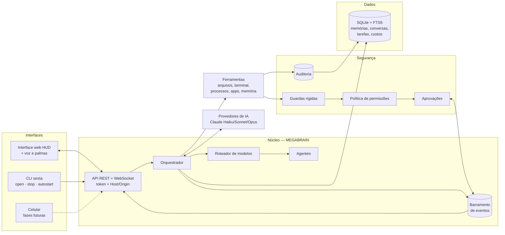
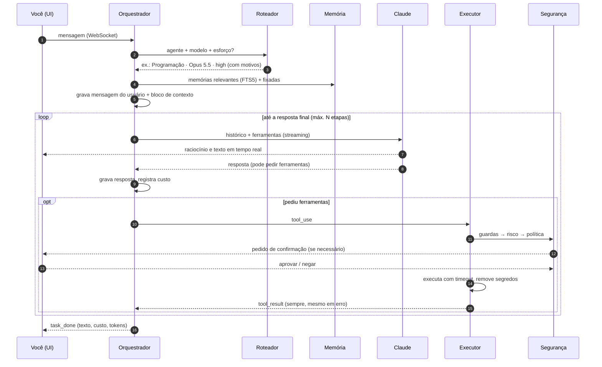

# Arquitetura da Sexta-Feira

Este documento explica **como** o sistema funciona e **por que** foi construído assim.
Cada decisão importante tem um registro (ADR) no final — quando mudarmos algo, adicionamos
um novo registro em vez de apagar o antigo.

## Visão geral

## Ciclo de um pedido

## Camadas e responsabilidades

| Pasta | Responsabilidade | Depende de |
|---|---|---|
| `llm/` | Falar com modelos de IA; catálogo de capacidades e preços | — |
| `memory/` | Banco SQLite, migrações, memórias, conversas | — |
| `security/` | Permissões, guardas, aprovações, auditoria | `memory/db` |
| `tools/` | Ações concretas (arquivos, terminal, memória…) | `security`, `memory` |
| `agents/` | Perfis especializados e seleção | `llm/catalog` |
| `core/` | Roteador, orquestrador, prompts, eventos, tarefas, custos | todos acima |
| `api/` + `app.py` | HTTP/WebSocket, autenticação, interface | `core` |
| `container.py` | Monta tudo (único lugar que conhece todas as peças) | todos |

Regra: dependências apontam **para baixo**. `llm/` não conhece ferramentas; ferramentas não
conhecem a API web. Isso permite trocar a interface (voz, app) ou o provedor de IA sem
reescrever o núcleo.

## Como estender

- **Nova ferramenta:** crie `args_model` (Pydantic) + `handler` assíncrono em `tools/`,
  declare `capability` e `risk` (e `assess` se o risco depender da entrada) e adicione à
  lista `TOOLS`. Ganha validação, permissões, aprovação, auditoria e UI automaticamente.
- **Novo agente:** adicione um `AgentProfile` em `agents/registry.py`.
- **Novo modelo/provedor:** registre um `ModelSpec` em `llm/catalog.py`; para outro
  provedor, implemente `LLMProvider.stream()` (traduzindo para/de content blocks).
- **Nova tabela/coluna:** acrescente uma migração ao final de `MIGRATIONS` em `memory/db.py`.
- **Nova interface:** assine o `EventBus` e use `Orchestrator.submit()`.

## Registros de decisão (ADR)

### ADR-001 — Python + FastAPI no núcleo
**Contexto:** precisamos de IA, automação do SO, finanças, voz e muitas integrações.
**Decisão:** Python 3.11+ com FastAPI (assíncrono, tipado com Pydantic, WebSocket nativo).
**Por quê:** ecossistema de IA/automação/dados mais rico; `psutil`, SDK oficial do Claude,
bibliotecas de voz (Whisper/Vosk) e finanças disponíveis. **Custo:** desempenho bruto menor
que Go/Rust — irrelevante para um assistente pessoal (o gargalo é a rede/IA).

### ADR-002 — SQLite + FTS5 para tudo (por enquanto)
**Decisão:** um único arquivo SQLite com busca textual FTS5 (BM25, sem acentos).
**Por quê:** zero instalação, transacional, backup = copiar o arquivo, rápido para milhões
de linhas. **Evolução:** busca semântica (embeddings) entra na Fase 3 atrás da mesma API do
`MemoryService`.

### ADR-003 — Roteamento local por regras explicáveis
**Decisão:** o roteador estima complexidade com sinais do texto (sem chamar uma IA).
**Por quê:** custo zero, latência zero, previsível e transparente (motivos exibidos).
**Evolução:** Fase 3 pode adicionar um classificador com Haiku para casos ambíguos e
aprendizado a partir do seu feedback.

### ADR-004 — Histórico *append-only* e prompt congelado por conversa
**Contexto:** os modelos atuais vinculam os blocos de raciocínio ao prefixo exato da
conversa; editar o passado invalida esse raciocínio e o cache de prompt.
**Decisão:** o *system prompt* é gerado uma vez por conversa; memórias, data/hora e agente
entram num bloco `<contexto_sexta>` anexado à mensagem do usuário e gravado junto. Nada é
editado depois. As ferramentas são declaradas em ordem fixa.
**Consequências:** cache de prompt eficiente (custo menor), raciocínio preservado entre
turnos. Mudar o perfil afeta **novas** conversas. Como rede de segurança, o provedor pede
à API para descartar blocos inválidos em vez de falhar (`drop_block`).

### ADR-005 — Segurança aplicada no código, não no prompt
**Decisão:** toda ferramenta passa pelo executor: validação → guardas → risco →
política → confirmação → execução com timeout → remoção de segredos → auditoria.
**Por quê:** um prompt pode ser manipulado (ex.: instruções escondidas num arquivo ou site);
código não. A IA vê todas as ferramentas, mas só executa o que a política permitir.

### ADR-006 — Interface web sem etapa de build
**Decisão:** HTML + CSS + JavaScript (módulos ES) servidos pelo próprio backend.
**Por quê:** nada para compilar, fácil de estudar e modificar, abre em qualquer navegador e
no celular. O núcleo se comunica só por REST/WebSocket, então a interface pode virar um app
desktop (Tauri/Electron) ou React no futuro sem mexer no backend.

### ADR-007 — Formato canônico de mensagens = content blocks da Messages API
**Decisão:** mensagens são armazenadas como blocos (`text`, `thinking`, `tool_use`,
`tool_result`…). **Por quê:** é o formato mais expressivo entre os provedores e preserva
assinaturas de raciocínio byte a byte. Outros provedores traduzem na borda.

### ADR-008 — Fallback de recusa e degradação graciosa
**Decisão:** requisições para Opus/Sonnet 5.5 incluem `fallbacks: "default"` (a API
reexecuta em outro modelo se um classificador de segurança recusar por engano). Se a conta
não suportar um recurso beta, o provedor o desliga e repete a requisição automaticamente.
Desative com `SEXTA_REFUSAL_FALLBACK=false`.

### ADR-009 — Uma tarefa por conversa por vez
**Decisão:** um lock por conversa serializa as tarefas; conversas diferentes rodam em
paralelo. **Por quê:** mantém o histórico ordenado e válido sem complicar a interface.

### ADR-010 — Voz no navegador (Web Speech API + speechSynthesis)
**Contexto:** queríamos voz grátis e simples no Windows 11, já na Fase 2.
**Decisão:** reconhecimento pela Web Speech API (pt-BR, contínuo) e fala pelo
`speechSynthesis` (vozes do Windows/Chrome/Edge). Nada para instalar além do navegador.
**Custo:** o áudio vai ao serviço de fala do navegador enquanto escuta (documentado; há modo
“só palmas”). **Evolução:** faster-whisper + openWakeWord locais quando quisermos privacidade
total — o resto do sistema não muda, pois a voz só conversa com o núcleo pelo WebSocket.

### ADR-011 — Palmas detectadas localmente em AudioWorklet
**Decisão:** detector próprio (pico + energia relativa + duração curta + intervalo entre
palmas) rodando na thread de áudio. **Por quê:** funciona com a janela minimizada (não depende
de `requestAnimationFrame`), é instantâneo, privado e testável (classe pura com testes no Node
usando sinais sintéticos; teste ponta a ponta com microfone falso no Chromium).

### ADR-012 — Início com o Windows: chave Run + janela dedicada
**Decisão:** `HKCU\...\Run` executa `pythonw -m sexta serve --app-window --headless --workdir …`.
O servidor sobe oculto (logs em arquivo, instância única) e abre o Chrome/Edge em modo app com
**perfil próprio** e flags que liberam áudio sem clique (`--autoplay-policy=…`) e evitam que a
janela “adormeça” minimizada. **Por quê:** não exige administrador (o Agendador de Tarefas
exigiria para gatilho de logon), é fácil de desfazer e não interfere no navegador do dia a dia.

### ADR-013 — Canal da mensagem (texto × voz) no núcleo
**Decisão:** cada pedido carrega `channel`; pedidos por voz recebem no contexto do turno a
instrução de responder de forma curta e falável, e os eventos levam o canal para a interface
decidir se fala a resposta. Mantém o histórico append-only (a instrução vai na mensagem do
usuário, não no system prompt).
