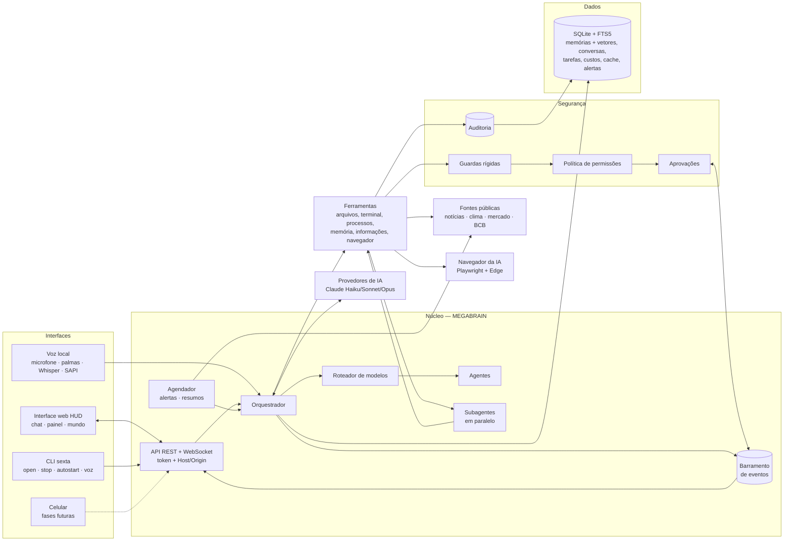
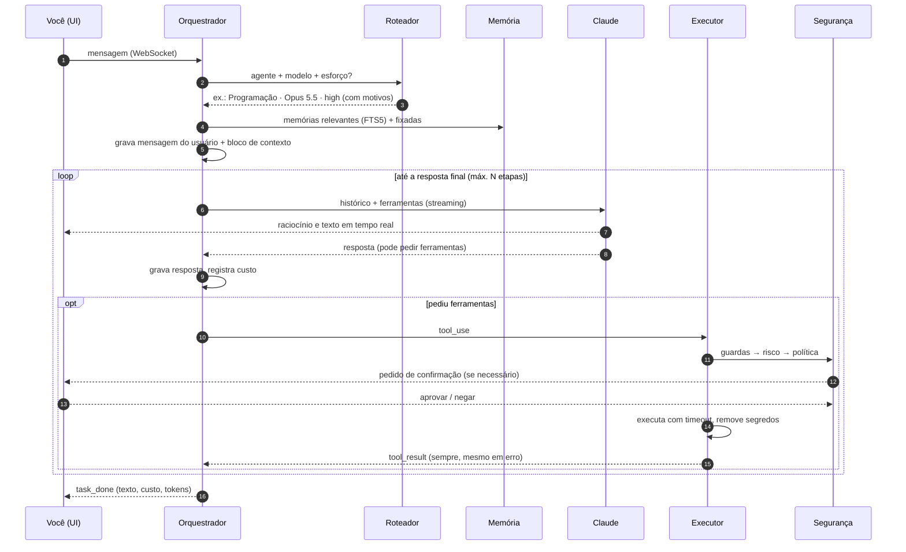

# Arquitetura da Sexta-Feira

Este documento explica **como** o sistema funciona e **por que** foi construído assim.
Cada decisão importante tem um registro (ADR) no final — quando mudarmos algo, adicionamos
um novo registro em vez de apagar o antigo.

## Visão geral

## Ciclo de um pedido

## Camadas e responsabilidades

| Pasta | Responsabilidade | Depende de |
|---|---|---|
| `llm/` | Falar com modelos de IA; catálogo de capacidades e preços | — |
| `memory/` | Banco SQLite, migrações, memórias (BM25 + vetores), conversas | — |
| `security/` | Permissões, guardas, aprovações, auditoria | `memory/db` |
| `intel/` | Notícias, clima, mercado, indicadores, cache, alertas, resumos, agendador | `memory/db` |
| `browser/` | Navegador da IA (thread dedicada), guardas de rede, `web_fetch` | `security` |
| `tools/` | Ações concretas (arquivos, terminal, memória, informações, navegador, delegação) | `security`, `memory`, `intel`, `browser` |
| `agents/` | Perfis especializados, seleção e delegação a subagentes | `llm/catalog`, `core/prompts` |
| `core/` | Roteador, orquestrador, prompts, eventos, tarefas, custos | todos acima |
| `voice/` | Voz local: áudio, DSP, ativação, transcrição, fala, máquina de estados | `core` (via orquestrador) |
| `api/` + `app.py` | HTTP/WebSocket, autenticação, interface | `core` |
| `container.py` | Monta tudo (único lugar que conhece todas as peças) | todos |

Regra: dependências apontam **para baixo**. `llm/` não conhece ferramentas; ferramentas não
conhecem a API web. Isso permite trocar a interface (voz, app) ou o provedor de IA sem
reescrever o núcleo.

## Como estender

- **Nova ferramenta:** crie `args_model` (Pydantic) + `handler` assíncrono em `tools/`,
  declare `capability` e `risk` (e `assess` se o risco depender da entrada) e adicione à
  lista `TOOLS`. Ganha validação, permissões, aprovação, auditoria e UI automaticamente.
- **Novo agente:** adicione um `AgentProfile` em `agents/registry.py`.
- **Novo modelo/provedor:** registre um `ModelSpec` em `llm/catalog.py`; para outro
  provedor, implemente `LLMProvider.stream()` (traduzindo para/de content blocks).
- **Nova tabela/coluna:** acrescente uma migração ao final de `MIGRATIONS` em `memory/db.py`.
- **Nova interface:** assine o `EventBus` e use `Orchestrator.submit()` (a voz local faz isso).
- **Nova fonte de dados:** função assíncrona em `intel/` usando `HttpClient` + `IntelCache.fetch`
  (cache com TTL e dado antigo quando a fonte cai) e um teste com `httpx.MockTransport`.
- **Novo agente para delegação:** basta o `AgentProfile` com a lista `tools`; o subagente só
  recebe essas ferramentas (mais `memory_search`).

## Registros de decisão (ADR)

### ADR-001 — Python + FastAPI no núcleo
**Contexto:** precisamos de IA, automação do SO, finanças, voz e muitas integrações.
**Decisão:** Python 3.11+ com FastAPI (assíncrono, tipado com Pydantic, WebSocket nativo).
**Por quê:** ecossistema de IA/automação/dados mais rico; `psutil`, SDK oficial do Claude,
bibliotecas de voz (Whisper/Vosk) e finanças disponíveis. **Custo:** desempenho bruto menor
que Go/Rust — irrelevante para um assistente pessoal (o gargalo é a rede/IA).

### ADR-002 — SQLite + FTS5 para tudo (por enquanto)
**Decisão:** um único arquivo SQLite com busca textual FTS5 (BM25, sem acentos).
**Por quê:** zero instalação, transacional, backup = copiar o arquivo, rápido para milhões
de linhas. **Evolução:** busca semântica (embeddings) entra na Fase 3 atrás da mesma API do
`MemoryService`.

### ADR-003 — Roteamento local por regras explicáveis
**Decisão:** o roteador estima complexidade com sinais do texto (sem chamar uma IA).
**Por quê:** custo zero, latência zero, previsível e transparente (motivos exibidos).
**Evolução:** Fase 3 pode adicionar um classificador com Haiku para casos ambíguos e
aprendizado a partir do seu feedback.

### ADR-004 — Histórico *append-only* e prompt congelado por conversa
**Contexto:** os modelos atuais vinculam os blocos de raciocínio ao prefixo exato da
conversa; editar o passado invalida esse raciocínio e o cache de prompt.
**Decisão:** o *system prompt* é gerado uma vez por conversa; memórias, data/hora e agente
entram num bloco `<contexto_sexta>` anexado à mensagem do usuário e gravado junto. Nada é
editado depois. As ferramentas são declaradas em ordem fixa.
**Consequências:** cache de prompt eficiente (custo menor), raciocínio preservado entre
turnos. Mudar o perfil afeta **novas** conversas. Como rede de segurança, o provedor pede
à API para descartar blocos inválidos em vez de falhar (`drop_block`).

### ADR-005 — Segurança aplicada no código, não no prompt
**Decisão:** toda ferramenta passa pelo executor: validação → guardas → risco →
política → confirmação → execução com timeout → remoção de segredos → auditoria.
**Por quê:** um prompt pode ser manipulado (ex.: instruções escondidas num arquivo ou site);
código não. A IA vê todas as ferramentas, mas só executa o que a política permitir.

### ADR-006 — Interface web sem etapa de build
**Decisão:** HTML + CSS + JavaScript (módulos ES) servidos pelo próprio backend.
**Por quê:** nada para compilar, fácil de estudar e modificar, abre em qualquer navegador e
no celular. O núcleo se comunica só por REST/WebSocket, então a interface pode virar um app
desktop (Tauri/Electron) ou React no futuro sem mexer no backend.

### ADR-007 — Formato canônico de mensagens = content blocks da Messages API
**Decisão:** mensagens são armazenadas como blocos (`text`, `thinking`, `tool_use`,
`tool_result`…). **Por quê:** é o formato mais expressivo entre os provedores e preserva
assinaturas de raciocínio byte a byte. Outros provedores traduzem na borda.

### ADR-008 — Fallback de recusa e degradação graciosa
**Decisão:** requisições para Opus/Sonnet 5.5 incluem `fallbacks: "default"` (a API
reexecuta em outro modelo se um classificador de segurança recusar por engano). Se a conta
não suportar um recurso beta, o provedor o desliga e repete a requisição automaticamente.
Desative com `SEXTA_REFUSAL_FALLBACK=false`.

### ADR-009 — Uma tarefa por conversa por vez
**Decisão:** um lock por conversa serializa as tarefas; conversas diferentes rodam em
paralelo. **Por quê:** mantém o histórico ordenado e válido sem complicar a interface.

### ADR-010 — Voz no navegador (Web Speech API + speechSynthesis)
**Contexto:** queríamos voz grátis e simples no Windows 11, já na Fase 2.
**Decisão:** reconhecimento pela Web Speech API (pt-BR, contínuo) e fala pelo
`speechSynthesis` (vozes do Windows/Chrome/Edge). Nada para instalar além do navegador.
**Custo:** o áudio vai ao serviço de fala do navegador enquanto escuta (documentado; há modo
“só palmas”). **Evolução:** faster-whisper + openWakeWord locais quando quisermos privacidade
total — o resto do sistema não muda, pois a voz só conversa com o núcleo pelo WebSocket.

### ADR-011 — Palmas detectadas localmente em AudioWorklet
**Decisão:** detector próprio (pico + energia relativa + duração curta + intervalo entre
palmas) rodando na thread de áudio. **Por quê:** funciona com a janela minimizada (não depende
de `requestAnimationFrame`), é instantâneo, privado e testável (classe pura com testes no Node
usando sinais sintéticos; teste ponta a ponta com microfone falso no Chromium).

### ADR-012 — Início com o Windows: chave Run + janela dedicada
**Decisão:** `HKCU\...\Run` executa `pythonw -m sexta serve --app-window --headless --workdir …`.
O servidor sobe oculto (logs em arquivo, instância única) e abre o Chrome/Edge em modo app com
**perfil próprio** e flags que liberam áudio sem clique (`--autoplay-policy=…`) e evitam que a
janela “adormeça” minimizada. **Por quê:** não exige administrador (o Agendador de Tarefas
exigiria para gatilho de logon), é fácil de desfazer e não interfere no navegador do dia a dia.

### ADR-013 — Canal da mensagem (texto × voz) no núcleo
**Decisão:** cada pedido carrega `channel`; pedidos por voz recebem no contexto do turno a
instrução de responder de forma curta e falável, e os eventos levam o canal para a interface
decidir se fala a resposta. Mantém o histórico append-only (a instrução vai na mensagem do
usuário, não no system prompt).

### ADR-014 — Voz local no PC (Vosk + faster-whisper + SAPI)
**Contexto:** o usuário quis o microfone do computador funcionando direto, sem depender da
janela do navegador. **Decisão:** um `VoiceEngine` no servidor: captura com `sounddevice`
(16 kHz, quadros de 20 ms), palmas pelo mesmo detector (portado para NumPy), palavra de
ativação com **Vosk** em gramática restrita (barato, roda sempre), e só depois da ativação a
transcrição com **faster-whisper** (int8, CPU, VAD, `hotwords="Sexta-Feira"`); fala com
SAPI (pywin32) e PowerShell como reserva. Máquina de estados explícita
(`idle → listening → transcribing → thinking → speaking`) e threads conversando com o loop
via `run_coroutine_threadsafe`. **Por quê:** privacidade (áudio não sai do PC), funciona com
o PC “sem tela”, custo zero. **Custo:** ~500 MB de modelos e alguma CPU durante a transcrição.

### ADR-015 — Informações: fontes públicas + cache com fonte e horário
**Decisão:** só fontes gratuitas e sem chave (Open-Meteo, BCB/SGS, AwesomeAPI, CoinGecko,
Yahoo chart, RSS, Google Notícias/Trends) atrás de um `HttpClient` único; tudo passa por
`IntelCache.fetch(chave, ttl, loader)` que guarda o horário da coleta e devolve o **último
dado salvo** (marcado como antigo) se a fonte falhar. **Por quê:** a regra do produto exige
fonte e horário em todo dado; o cache economiza chamadas e mantém a tela útil offline.
**Detalhe aprendido:** no Yahoo, `chartPreviousClose` com `range=5d` é o fechamento de 5 dias
atrás — a variação diária usa o último pregão anterior ao dia da cotação.

### ADR-016 — Agendador dentro do processo
**Decisão:** um laço de 30 s (`Scheduler.tick`) roda alertas a cada 5 min, pré-carrega dados a
cada 20 min e gera resumos nos horários configurados (uma vez por data/horário, com janela de
4 h para quando o PC estava desligado). Estado em `scheduler_state`. **Por quê:** a Sexta-Feira
já fica ligada com o Windows; um agendador externo (Agendador de Tarefas) seria mais frágil e
pediria permissões. Resumos usam a IA na camada Equilibrado, com texto-modelo se ela falhar.

### ADR-017 — Multiagente como ferramenta (`delegate_tasks`)
**Decisão:** em vez de um planejador separado, a própria IA principal decide quando dividir
o trabalho chamando a ferramenta `delegate_tasks` (até 4 subtarefas). Cada subagente roda um
ciclo IA + ferramentas próprio, em paralelo (semáforo de 3), com modelo escolhido pelo
roteador, **lista fechada de ferramentas checada no código**, o mesmo `ToolExecutor` e sem
poder delegar de novo. As conversas dos subagentes ficam em memória; o relatório volta como
`tool_result`. **Por quê:** reaproveita roteamento, permissões, aprovação, auditoria e
cancelamento sem duplicar nada, e mantém o histórico append-only intacto. O custo é somado à
tarefa (`UsageTracker.task_cost`).

### ADR-018 — Memória semântica: NumPy + RRF em vez de banco vetorial
**Decisão:** embeddings locais com `fastembed` (`paraphrase-multilingual-MiniLM-L12-v2`,
384 dim, ONNX) guardados como BLOB em `memory_vectors`; a busca carrega a matriz em memória
e faz produto escalar com NumPy. O resultado é fundido ao do BM25 por **Reciprocal Rank
Fusion** (1/(60+posição)), com um pequeno peso de importância. **Por quê:** memórias pessoais
são milhares, não milhões — NumPy resolve em milissegundos sem extensão nativa do SQLite
(sqlite-vec), e o RRF dispensa calibrar escalas de BM25 × cosseno. Sem o pacote opcional, tudo
continua só com BM25. Mesclar duplicatas é sempre uma escolha do usuário.

### ADR-019 — Navegador da IA numa thread dedicada, com guardas de rede
**Decisão:** Playwright (API síncrona) confinado a uma thread (`ThreadPoolExecutor(1)`), Edge
do Windows com perfil próprio, janela visível por padrão. A página vira uma lista numerada de
elementos (`data-sexta-ref`) + texto; a IA age pelo número. Guardas no código: só http(s),
bloqueio de rede local por resolução de DNS em **cada requisição** (`context.route`), campos
sensíveis nunca preenchidos, risco do clique calculado pelo texto real do elemento e
verificação de que o elemento não mudou entre a aprovação e o clique. **Por quê:** isolar o
Playwright evita conflitos de loop (no Windows ele precisa do loop Proactor para subprocessos)
e mantém o servidor responsivo; as guardas impedem que um site use a IA para atacar a rede
local ou a própria Sexta-Feira.

### ADR-020 — IA pela assinatura Claude Pro (Claude Code como provedor)
**Contexto:** o usuário tem o plano Claude Pro e não pode pagar créditos da API à parte.
**Decisão:** um provedor `claude-code` (`llm/claude_code.py`) que chama o CLI oficial
`claude -p` (modo não interativo) logado na assinatura. Ele roda **sem nenhuma ferramenta
nativa** (`--tools ""`), sem personalizações (`--safe-mode`), numa pasta vazia, e sem
`ANTHROPIC_API_KEY` no ambiente (nunca cobra na API). As ferramentas da Sexta-Feira vão no
prompt de sistema; o modelo pede uma com `<tool_call>{"name","input"}</tool_call>` e o
provedor converte em blocos `tool_use` — orquestrador, executor, permissões, aprovações,
auditoria e histórico append-only seguem idênticos. O histórico vai como transcrição (com
imagens) a cada chamada. `auto` prefere a assinatura; custo registrado = 0; o uso do plano
(janela de 5 h/semanal, vindo do `rate_limit_event`) aparece na interface.
**Aprendido:** com QUALQUER ferramenta nativa ligada (ex.: WebSearch) o modelo tenta chamar as
ferramentas da Sexta como nativas e falha em silêncio — por isso nenhuma fica ligada, e a busca
na web usa `web_fetch` (DuckDuckGo HTML), `news_search` e o navegador. Um lembrete no fim de
cada pedido evita que ele “diga que fez” sem emitir o bloco.
**Custo:** uma chamada de processo por etapa (alguns segundos a mais por resposta), sem cache
de prompt controlado por nós, e o limite de uso do plano.

